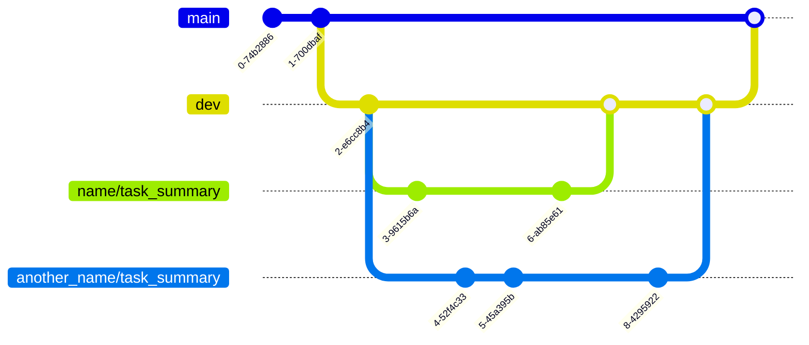

# Micron Dynamics of Electron Tunneling - Central Repository

*In development  
[Markdown Syntax Guide](https://www.markdownguide.org/basic-syntax/)

## Project Summary
x

### Previous Work
Among other things, the previous team discovered a crucial case of unexpected behavior. A spontaneous set of a neighboring cell.  

[Git Repository](https://github.com/mihirsavadi/MicronDynamicsOfElectronTunneling)

	
### Goal
To capture (measure) aforementioned unexpected behavior, then explore limits of neighboring cell.

### Procedure
1. Measure a test case
2. Analyze test case
3. Plan next test case, to get closer to goal
4. Repeat

## Overview
This repo serves to make measurement analysis (step 2) and its interactions efficient. Thus, increasing the efficiency of both measurement (step 1) and planning (step 3).

## Instructions
> For detailed instructions on how to use this repo to analyze measurement data, see `INSTRUCTIONS.txt`.
	
## Developer Notes
For detailed guidelines, see `internal_guidelines.txt`. 

## Workflow
The `main` branch always contains stable code. The `dev` branch contains potentially unstable code. To make changes, developers branch off `dev` with `their_name/task_summary`. `dev` is merged with `main` periodically, after testing its functionality and verifying its stability. 

## Cell Mapping

### Overview
The cell naming convention used.

### Grid Coordinate System
*Improve this image  

